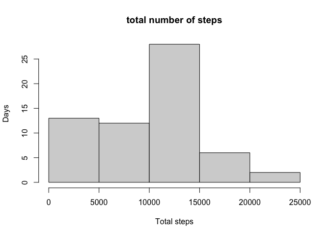

## Loading and preprocessing the data

Unzip and read the data.  


```r
unzip("activity.zip", exdir = ".")
df_full <- read.csv("activity.csv", sep = ",", header = TRUE)
```

Transforming date variable from character to date.  

```r
df_full$date <- as.Date(df_full$date, format="%Y-%m-%d")
str(df_full)
```

```
## 'data.frame':	17568 obs. of  3 variables:
##  $ steps   : int  NA NA NA NA NA NA NA NA NA NA ...
##  $ date    : Date, format: "2012-10-01" "2012-10-01" ...
##  $ interval: int  0 5 10 15 20 25 30 35 40 45 ...
```

## What is mean total number of steps taken per day?

I am using the the dplyr package to group and summarise the data.  
For the histogram, I am using the base system here.  


```r
library(dplyr)
```

```
## 
## Attaching package: 'dplyr'
```

```
## The following objects are masked from 'package:stats':
## 
##     filter, lag
```

```
## The following objects are masked from 'package:base':
## 
##     intersect, setdiff, setequal, union
```

```r
df <- select(df_full, steps,date)
df <- group_by(df, date)

df_sum <- summarise(df, steps_sum=sum(steps,na.rm=TRUE))

with(df_sum, hist(steps_sum, main="total number of steps", xlab="Steps", ylab="Days"))
```

<!-- -->

For mean and median, I have created new variables.    


```r
mean <- summarise(df_sum, mean=mean(steps_sum,na.rm=TRUE))
median <- summarise(df_sum, median=median(steps_sum,na.rm=TRUE))

mean
```

```
## # A tibble: 1 x 1
##    mean
##   <dbl>
## 1 9354.
```

```r
median
```

```
## # A tibble: 1 x 1
##   median
##    <int>
## 1  10395
```

##### Mean total steps per day is 9354 and the median total steps per day is 10395.    


## What is the average daily activity pattern?

First, I am grouping by Interval, then calculate the mean steps.  
Then I am plotting the result, using the base system.  


```r
temp1 <- group_by(df_full, interval)
avg_steps <- summarise(temp1, avg_steps=mean(steps,na.rm = TRUE))
plot(avg_steps$interval, avg_steps$avg_steps, xlab = "Intervall", ylab= "Average Steps", type="l")
```

<!-- -->

```r
interval <- arrange(avg_steps, desc(avg_steps))$interval[1] 
interval
```

```
## [1] 835
```

##### For the  intervall with the maximum steps, I am ordering the data descending and subset the first (highest) value.  
##### The intervall with the highest values is 835. In this intervall there are on average about 206 steps.  
        

## Imputing missing values

Firstly, I count the na values.  

```r
totalna = sum(is.na(df_full))
totalna
```

```
## [1] 2304
```
##### There are a total of 2304  missing values!  

Next we impute. I use the mean of all steps (about 37) as the imputed value.  
So basically, this is a fairly simple technique here.  


```r
df_nona <- data.frame(df_full)

for(i in 1:ncol(df_nona)){
        df_nona[is.na(df_nona[,i]), i] <- mean(df_nona[,i], na.rm = TRUE)
}
head(df_nona)
```

```
##     steps       date interval
## 1 37.3826 2012-10-01        0
## 2 37.3826 2012-10-01        5
## 3 37.3826 2012-10-01       10
## 4 37.3826 2012-10-01       15
## 5 37.3826 2012-10-01       20
## 6 37.3826 2012-10-01       25
```

##### We see that the na values are replaced by the mean.  

We again plot the data and calculate the mean and median.  


```r
df_nona <- group_by(df_full, date)

df_nona_sum <- summarise(df_nona, steps_sum=sum(steps,na.rm=TRUE))

with(df_nona_sum, hist(steps_sum, main="total number of steps", xlab="Total steps", ylab="Days"))
```

<!-- -->

```r
mean2 <- summarise(df_nona_sum, mean=mean(steps_sum,na.rm=TRUE))
median2 <- summarise(df_nona_sum, median=median(steps_sum,na.rm=TRUE))

mean2
```

```
## # A tibble: 1 x 1
##    mean
##   <dbl>
## 1 9354.
```

```r
median2
```

```
## # A tibble: 1 x 1
##   median
##    <int>
## 1  10395
```

##### At least with this imputation procedure, we see that there are no differecne compared to the values with missing data.

## Are there differences in activity patterns between weekdays and weekends?  

First we use the time data package, transform date Variable into a "date" and split with the weekdays command between weekdays and weekend. Then we group by this vaiable and the interval and calculates the mean steps.  


```r
library(timeDate)
df_nona2 <- df_nona
df_nona2$date <- as.Date(df_nona2$date)
df_nona2$weekend <- ifelse(isWeekday(df_nona2$date, wday=1:5), "Weekdays", "Weekend")


df_nona2 <- group_by(df_nona2, weekend, interval)
df_sum2 <- summarise(df_nona2, steps=mean(steps,na.rm=TRUE))
```

For plotting I am using ggplot here.   


```r
library(ggplot2)
ggplot(df_sum2, aes(x = interval, y = steps,colour=weekend)) + 
geom_line(aes(colour=weekend))+ xlab("Interval")+ 
ylab("Number of steps ")+facet_wrap(~weekend)+
theme(strip.background = element_rect(fill="orange"))
```

<!-- -->

##### We see the peak for steps for weekdays, but in general a bit higher activity during weekends.  

